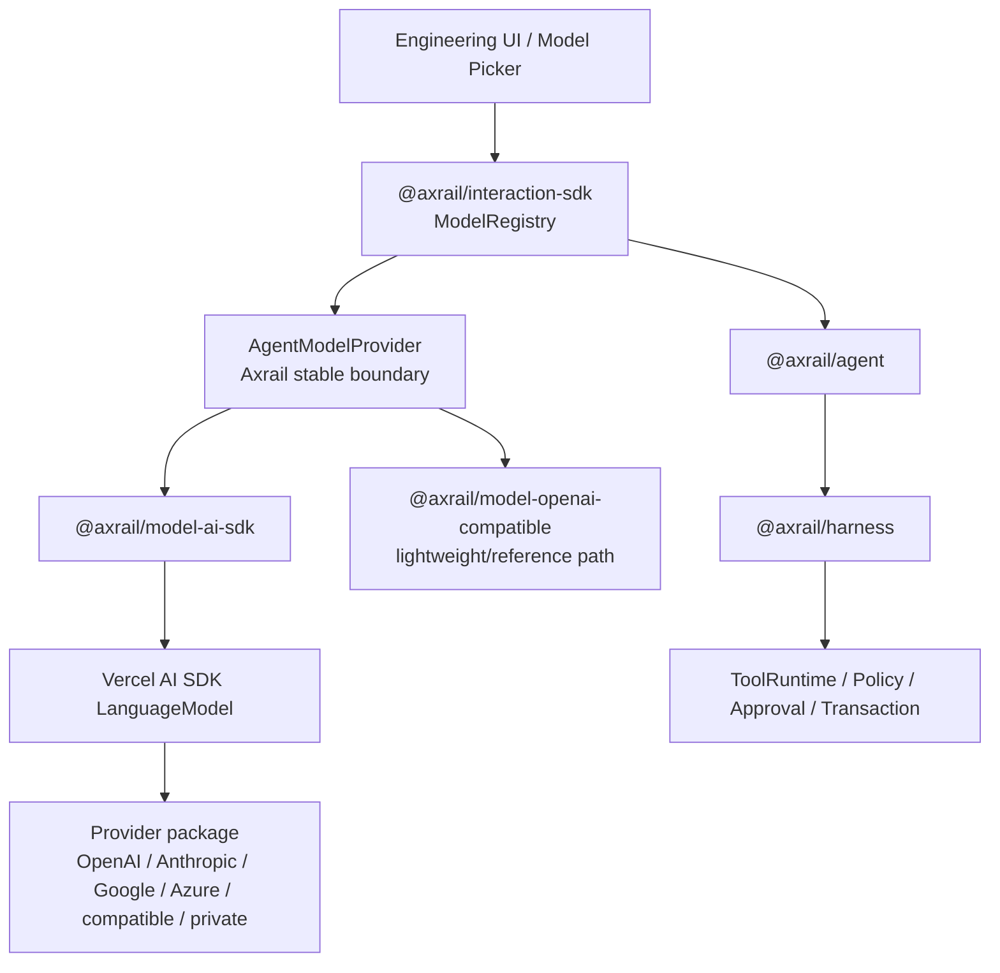

# Model Provider Convergence on Vercel AI SDK

Status: **v0.2 / post-RC implementation**

## Architecture



## Ownership

Axrail owns:
- `AgentModelProvider`;
- Agent request/response contracts;
- Interaction ModelRegistry and model selection;
- model capability/provenance semantics;
- governed Tool execution.

Vercel AI SDK owns:
- vendor/provider request protocol;
- provider-specific model transport;
- common model message/tool schema;
- provider response normalization.

The embedding application owns:
- which AI SDK provider packages are installed;
- model IDs;
- provider credentials and secret resolution.

## Single model step only

`@axrail/model-ai-sdk` performs one model generation step.

It intentionally does **not** use AI SDK Agents/Workflows to execute engineering Tools.

```text
AI SDK produces tool call
        ↓
Axrail AgentLoop receives it
        ↓
Axrail ToolRuntime
        ↓
Risk / Policy / Approval / Audit
        ↓
Tool effect
        ↓
next Axrail model step
```

AI SDK Tool definitions are supplied without `execute` handlers.

## Runtime baseline

The v0.2/post-RC development baseline is:

```text
Node.js >=22.13.0
CI: Node 22 / 24 / 26
Coverage: Node 22
```

This does not retroactively change published npm `0.1.0-rc.1`, whose exact provenance commit remains Node >=20.

## Package strategy

Preferred:
```text
@axrail/model-ai-sdk
  ↓
ai
  ↓
@ai-sdk/<provider> or compatible/private LanguageModel
```

Retained reference:
```text
@axrail/model-openai-compatible
```

Axrail should not add a new hand-written HTTP provider package for each vendor unless a concrete capability cannot be expressed through the AI SDK bridge.

## Credentials

Credentials never enter Axrail model descriptors, Selection Context, engineering Context, Interaction events, or governance evidence.

They remain inside provider construction, for example an `@ai-sdk/*` provider configured by the embedding application.

## Non-goals

- replacing Axrail AgentLoop with an AI SDK Agent;
- automatic Tool execution by AI SDK;
- mandatory AI Gateway;
- credential storage;
- automatic model routing or fallback.
