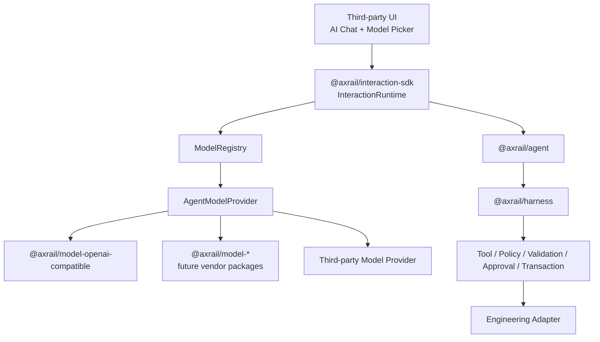
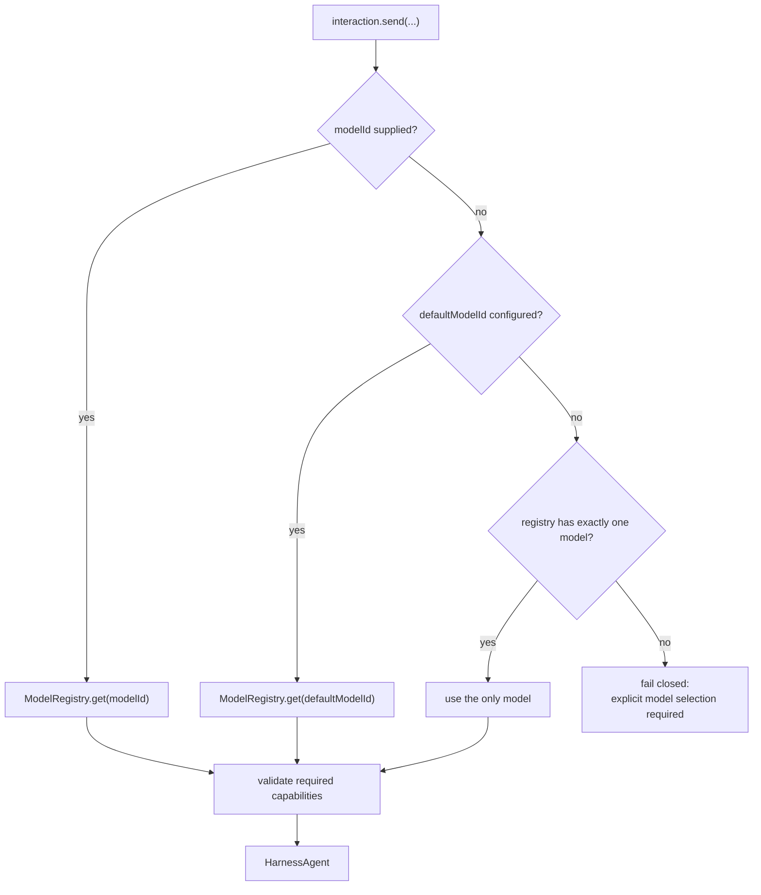

# Model Registry and Runtime Model Selection

Status: **post-RC implementation workstream**

This document defines where model registration and model switching live in Axrail.

## 1. Architecture



The ownership rule is:

```text
@axrail/agent
  model protocol

@axrail/model-*
  concrete provider implementation + credential resolution

@axrail/interaction-sdk
  model registry
  model picker data
  explicit per-turn selection
  capability validation
  model provenance

@axrail/harness
  model-agnostic governed execution
```

## 2. Why model choice does not belong in Harness

Harness is the engineering execution authority boundary.

Model selection is an intent-generation concern.

A selected model may affect:

- quality;
- latency;
- cost;
- context window;
- tool-calling support;
- vision/reasoning capability.

It must **not** affect:

- Policy authority;
- Approval requirements;
- Tool risk;
- Transaction semantics;
- provider-bound engineering effect identity.

Therefore:

```text
stronger model
  ≠ lower engineering risk
  ≠ automatic approval
  ≠ extra execution authority
```

## 3. Runtime selection

The first version is explicit and deterministic.



No silent fallback is performed.

## 4. Model descriptor

A public descriptor is intentionally descriptive and secret-free:

```ts
interface InteractionModelDescriptor {
  id: string
  providerId: string
  displayName?: string
  contextWindow?: number
  capabilities?: {
    toolCalling?: boolean
    structuredOutput?: boolean
    vision?: boolean
    reasoning?: boolean
    streaming?: boolean
  }
}
```

The registry stores the descriptor together with the in-process `AgentModelProvider` instance.

## 5. Credential boundary

Credentials do not belong in:

- ModelDescriptor;
- Interaction events;
- SelectionContext;
- Adapter Context;
- model provenance;
- audit metadata.

They remain inside concrete provider configuration.

Example:

```ts
new OpenAICompatibleResponsesProvider({
  model: "some-model",
  apiKey: async () => secretStore.get("MODEL_API_KEY"),
})
```

## 6. Plugin registration

Interaction plugins may register model providers:

```ts
setup(api) {
  return api.registerModel({
    descriptor: {
      id: "factory-model",
      providerId: "vendor-private",
      capabilities: {
        toolCalling: true,
      },
    },
    provider,
  })
}
```

Model registration follows the same reversible plugin lifecycle:

```text
plugin setup
  ↓
register model
  ↓
later setup failure
  ↓
model registration rolled back
```

This adds model extensibility without granting governance authority.

## 7. Capability validation

A turn can declare required capabilities.

Example:

```ts
await interaction.send({
  message,
  providerId: "vendor-hmi",
  modelId: "engineering-model",
  requiredModelCapabilities: ["toolCalling"],
})
```

Required capabilities must be explicitly declared as supported by the selected descriptor.

```text
required = true
descriptor capability = true
  → proceed

required = true
descriptor capability = false / undefined
  → fail before Agent/model execution
```

## 8. Model provenance

Every selected model produces non-secret provenance:

```text
modelId
modelProviderId
runtimeProviderId
```

This is propagated into:

- `interaction.model.selected`;
- `InteractionResult.model`;
- Harness Agent metadata / Session correlation.

It is provenance only, not governance evidence.

## 9. UI model picker

Third-party UI can build a picker from:

```ts
interaction.models.list()
```

Then pass the selected logical ID on every turn:

```ts
await interaction.send({
  message,
  providerId: "vendor-hmi",
  modelId: selectedModelId,
})
```

The application may persist a user's preference. InteractionRuntime does not introduce mutable global per-user model state.

## 10. Non-goals

The first version does not add:

- automatic model routing;
- fallback chains;
- cost/quota optimization;
- model marketplace;
- credential store;
- cloud model control plane;
- model-specific governance privileges.

## 11. Related architecture

- RFC-0011 Headless Interaction SDK and Plugin Model
- RFC-0012 Model Registry and Runtime Model Selection
- `docs/architecture/interaction-sdk-plugin-architecture.md`
